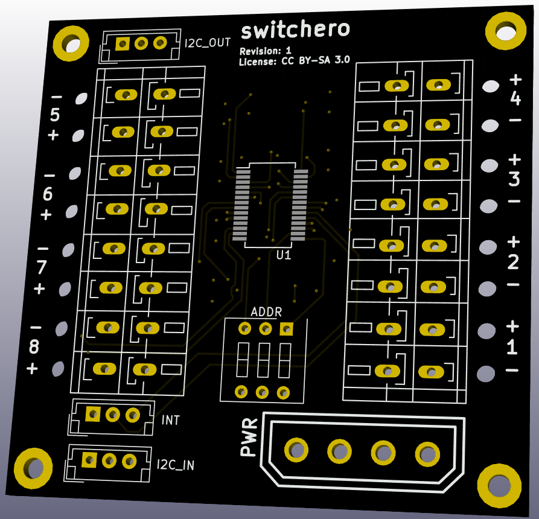
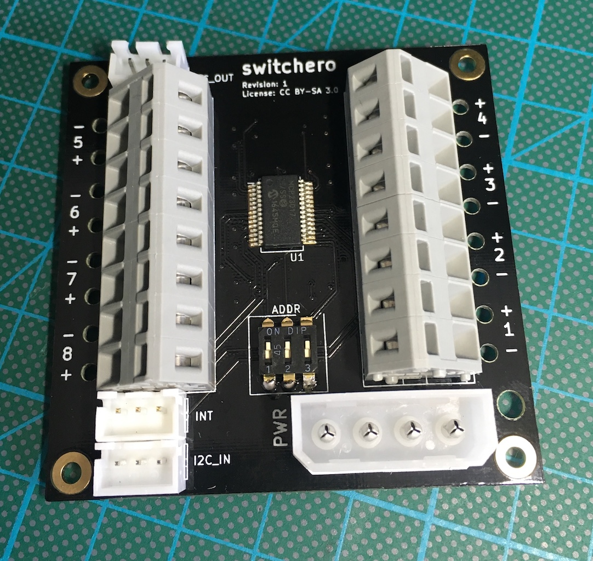
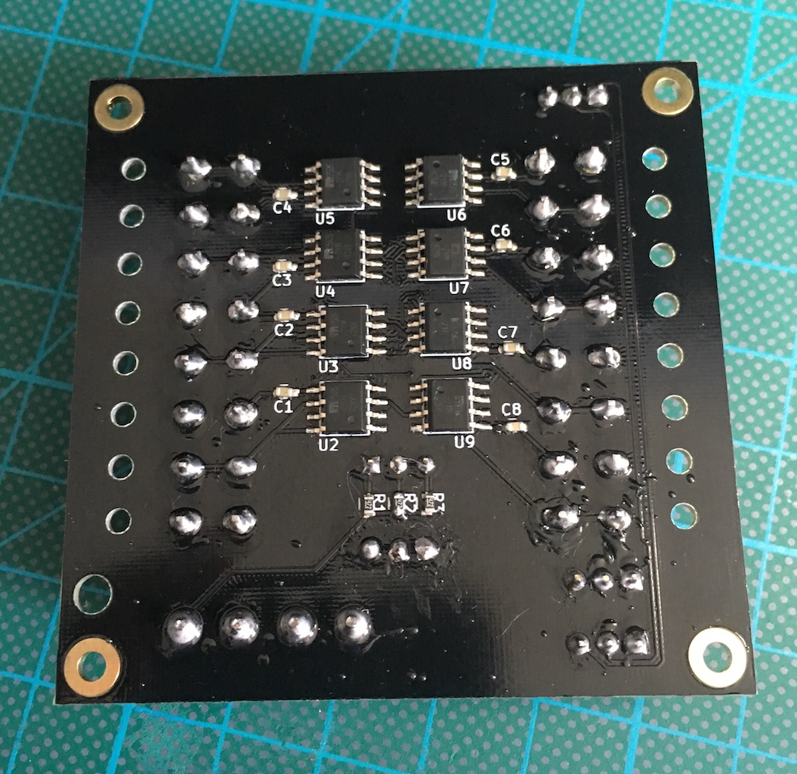
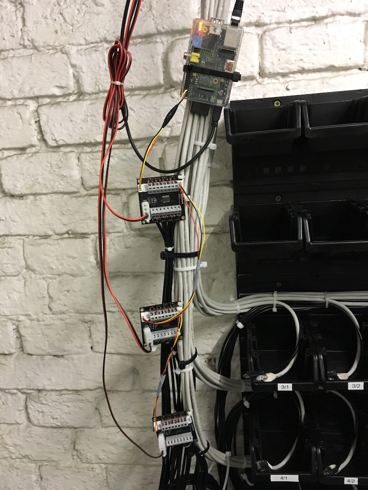

# switchero
I2C controlled power switch with current and fault limiting.

Originally created by [@wnagele](https://github.com/wnagele) and [@oe1rfc](https://github.com/oe1rfc) for switching USB power supplies of embedded boards in the [FunkFeuer Wien Housing](http://housing.funkfeuer.at).

## License
All work is licensed under [CC BY-SA 3.0](LICENSE.txt).

## Schematic and Gerbers
Gerbers of the revisions can be found in the [releases](https://github.com/FunkFeuer/switchero/releases). The schematics, etc. are provided in KiCad project format.

## Bill of Material
The BoM is available as [CSV file](switchero.csv).

## Board
The board is a 4 layer PCB and about 60x60mm.

This is a quick 3D render of the board:

Front and back of an assembled board (pardon the "questionable" soldering work):

Mounted with daisy chained I2C for the housing project:

